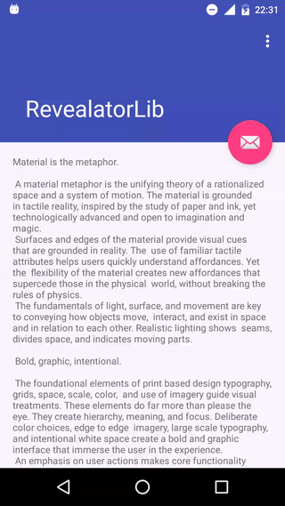

Android Revealator
========

An helper to circle reveal/unreveal a view easily, with translations and childs animations.
The libraries is Android 15+ compatible.



Installation
--------
Gradle

```java
repositories {
  	maven { url "https://jitpack.io" }
}
```

```java
compile 'com.github.jaouan:revealator:0.0.1'
```

Usage
--------

Just put the view you want to animate in a `io.codetail.widget.RevealFrameLayout`...

```xml
<io.codetail.widget.RevealFrameLayout
        android:layout_width="match_parent"
        android:layout_height="match_parent">

        <FrameLayout
            android:id="@+id/the_awesome_view"
            android:layout_width="match_parent"
            android:layout_height="match_parent"
            android:background="@color/colorAccent"
            android:visibility="invisible">

                      <TextView
                        android:layout_width="match_parent"
                        android:layout_height="wrap_content"
                        android:text="Lorem ipsum" />


        </FrameLayout>

    </io.codetail.widget.RevealFrameLayout>
```

... and use the Revealator's magic to reveal...
```java
Revealator.reveal( theAwesomeViewYouWantToReveal )
    .from( theInitiatorViewYouWantToTranslate )
    .withChildsAnimation()
    //.withDelayBetweenChildAnimation(...)
    //.withChildAnimationDuration(...)
    //.withTranslateDuration(...)
    //.withRevealDuration(...)
    //.withEndAction(...)
    .start();
```

... or unreveal.
```java
Revealator.unreveal( theAwesomeViewYouWantToUnreveal )
    //.withDuration(...)
    //.withEndAction(...)
    .start();
```

References
========

This project uses [ozodrukh's CircularReveal](https://github.com/ozodrukh/CircularReveal) for Android 4 compatibility.

License
========

[Apache License Version 2.0](LICENSE)